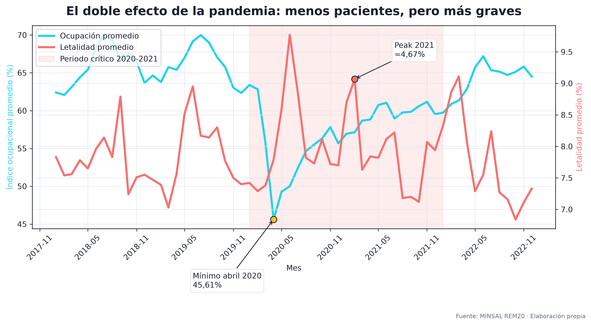

# Análisis Hospitalario REM20 Chile 2014-2026

Estudio end-to-end de indicadores hospitalarios REM20 del Ministerio de Salud de Chile (MINSAL), orientado a transformar datos públicos en una base analítica reproducible, visualizaciones, modelo predictivo, API, dashboard web e informe PDF.

Repositorio público: <https://github.com/Mati1993145/Analisis_Hospitalario>

Autor: Matías Durán · Data & Business Analyst

## Propósito

Este proyecto analiza la evolución mensual de indicadores hospitalarios chilenos entre 2014 y 2026, con foco en ocupación, letalidad, desempeño por establecimiento y cambios asociados al periodo COVID-19. El flujo completo cubre ingesta de datos, modelamiento relacional, análisis estadístico, machine learning, exposición vía API y visualización web.

> Nota: 2026 corresponde a un periodo parcial.

## Stack tecnológico

| Capa | Tecnologías |
| --- | --- |
| Base de datos | PostgreSQL |
| Análisis y ML | Python 3.12, pandas, scikit-learn, statsmodels, matplotlib |
| API | FastAPI, Uvicorn |
| Frontend | HTML, CSS, JavaScript, Plotly.js |
| Reportería | reportlab |
| Conexión de datos | SQLAlchemy |
| Versionamiento | Git, GitHub |

## Imagen destacada



## Arquitectura del pipeline

```text
CSV REM20
  -> PostgreSQL
  -> vistas SQL
  -> análisis Python / ML
  -> API FastAPI
  -> dashboard web + informe PDF
```

El backend FastAPI también sirve el frontend estático. El dashboard no es un sitio publicado: requiere el backend (`uvicorn`) corriendo y la base PostgreSQL disponible.

## Hallazgos principales

El informe completo está disponible en [data/processed/Informe_REM20_Chile_2014-2026.pdf](data/processed/Informe_REM20_Chile_2014-2026.pdf).

- Doble efecto COVID: la ocupación llegó a su mínimo en abril de 2020 (45,61%) mientras la letalidad subió desde aproximadamente 2,8% en 2014-2019 a 4,31% en 2020 y 4,67% en 2021. El sistema atendió menos pacientes, pero más graves.
- Meseta post-pandemia: la letalidad se estabiliza alrededor de 3,2% en 2023-2026, por sobre el nivel pre-pandemia cercano a 2,8%.
- Ocupación altamente predecible a corto plazo: el modelo Random Forest alcanza R²=0,636, con `lag_1` (mes anterior) explicando 73% de la importancia.
- Calidad de datos como eje metodológico: se detectaron 3 conflictos de clave primaria, corregidos caso por caso y documentados, sin borrar registros.
- Datos analizados: 165.232 registros, 208 establecimientos, periodo 2014-2026.

## Reproducción paso a paso

Comandos verificados para Windows / PowerShell.

### 1. Clonar el repositorio

```powershell
git clone https://github.com/Mati1993145/Analisis_Hospitalario.git
cd Analisis_Hospitalario
```

### 2. Crear entorno virtual

```powershell
python -m venv venv
.\venv\Scripts\Activate.ps1
```

También se puede usar el intérprete directamente:

`.\venv\Scripts\python.exe`

### 3. Instalar dependencias

```powershell
pip install -r requirements.txt
```

### 4. Configurar credenciales

Copiar `.env.example` a `.env` y completar `DB_HOST`, `DB_PORT`, `DB_NAME`, `DB_USER`, `DB_PASSWORD`.

### 5. Crear base y esquema

Requiere PostgreSQL y `psql`.

```powershell
psql -U postgres -f sql/ddl/01_create_database.sql
psql -U postgres -d rem20_db -f sql/ddl/02_create_tables.sql
psql -U postgres -d rem20_db -f sql/ddl/03_create_views.sql
```

### 6. Cargar datos

Coloca el CSV crudo en `data/raw/`.

```powershell
python python/scripts/01_load_data.py
```

### 7. Corregir conflictos de clave primaria (opcional)

```powershell
python python/scripts/03_corrige_conflictos.py
```

### 8. Ejecutar análisis / EDA (opcional)

Usar los notebooks en `python/notebooks/` y los scripts `02_*`.

### 9. Generar gráficos e informe PDF

```powershell
python python/scripts/04_genera_graficos_informe.py
python python/scripts/05_genera_informe_pdf.py
```

### 10. Levantar backend + dashboard

```powershell
uvicorn backend.main:app --reload --port 8000
```

O usando el intérprete del entorno virtual directamente:

```powershell
.\venv\Scripts\python.exe -m uvicorn backend.main:app --port 8000
```

### 11. Abrir dashboard y documentación API

- Dashboard: `http://localhost:8000`
- Documentación interactiva de la API: `http://localhost:8000/docs`

## Cómo adaptar a otra base de datos

El proyecto está preparado para reutilizarse con otra fuente de datos, pero los cambios deben hacerse en los puntos correctos para mantener alineados base de datos, scripts, API y dashboard.

Archivos principales a editar:

- `backend/config.py`: cambiar `SCHEMA`, `TABLE_INDICADORES`, nombres de vistas `VIEW_*` y rutas de CSV si cambian los artefactos procesados.
- `sql/ddl/02_create_tables.sql` y `sql/ddl/03_create_views.sql`: ajustar estructura de la tabla y definición de las vistas analíticas.
- `python/scripts/01_load_data.py`: adaptar columnas esperadas y mapeo del CSV de origen.
- `backend/queries.py` y `frontend/dashboard.js`: modificar consultas, endpoints consumidos o campos devueltos si cambia la salida de la API.

Ver [CONFIG.md](CONFIG.md) para el detalle de parametrización y reutilización.

## Estructura del proyecto

```text
Analisis_Hospitalario/
├── backend/                  API FastAPI
│   ├── config.py             configuración central (esquema, tablas, vistas, rutas)
│   ├── database.py           conexión PostgreSQL (lee .env)
│   ├── queries.py            consultas a las vistas/tablas
│   ├── main.py               app FastAPI + sirve el frontend
│   └── README.md
├── frontend/                 dashboard web (HTML/CSS/JS + Plotly)
│   ├── index.html, styles.css, dashboard.js, README.md
├── python/
│   ├── scripts/              01_load_data.py, 02_*, 03_corrige_conflictos.py,
│   │                         04_genera_graficos_informe.py, 05_genera_informe_pdf.py
│   └── notebooks/            01_eda_rem20.ipynb, 02_analisis_estadistico.ipynb
├── sql/ddl/                  01_create_database.sql, 02_create_tables.sql, 03_create_views.sql
├── data/
│   ├── raw/                  CSV crudo REM20 (gitignored)
│   └── processed/            CSVs, graficos/, graficos_informe/, modelos/ (.pkl gitignored),
│                             Informe_REM20_Chile_2014-2026.pdf
├── powerbi/                  README_powerbi.md, README_mcp.md
├── .env.example              plantilla de credenciales (sin secretos)
├── requirements.txt
├── BITACORA.md               bitácora del proyecto
├── CONFIG.md                 guía de reutilización
└── README.md
```

## Licencia y autoría

El código se publica bajo licencia MIT con fines de portafolio y educativos. Ver `LICENSE`.

Los datos provienen de fuente pública del MINSAL de Chile, serie REM20.

Autor: Matías Durán · Data & Business Analyst.
